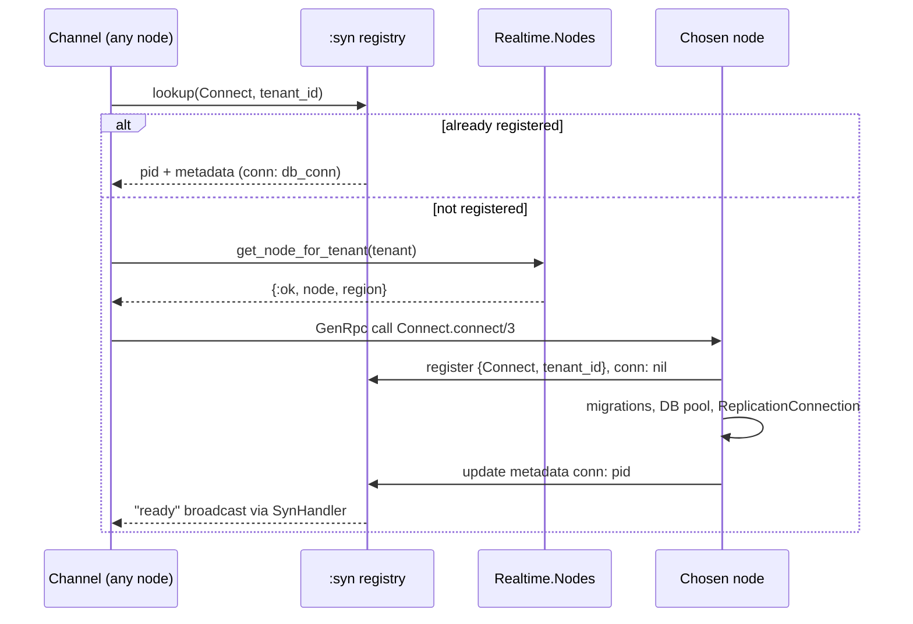
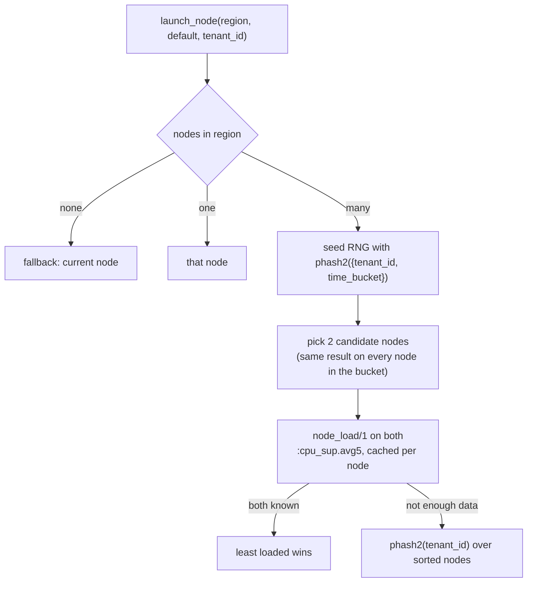
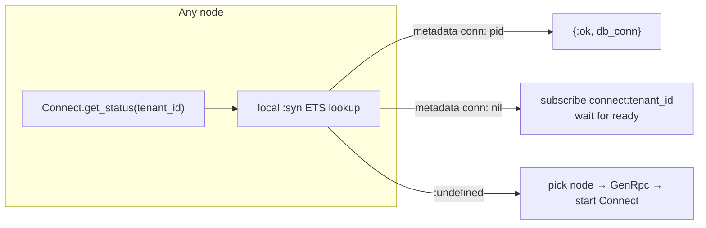
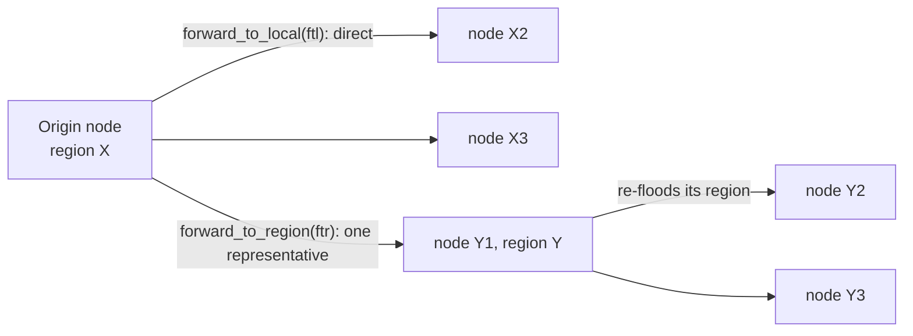
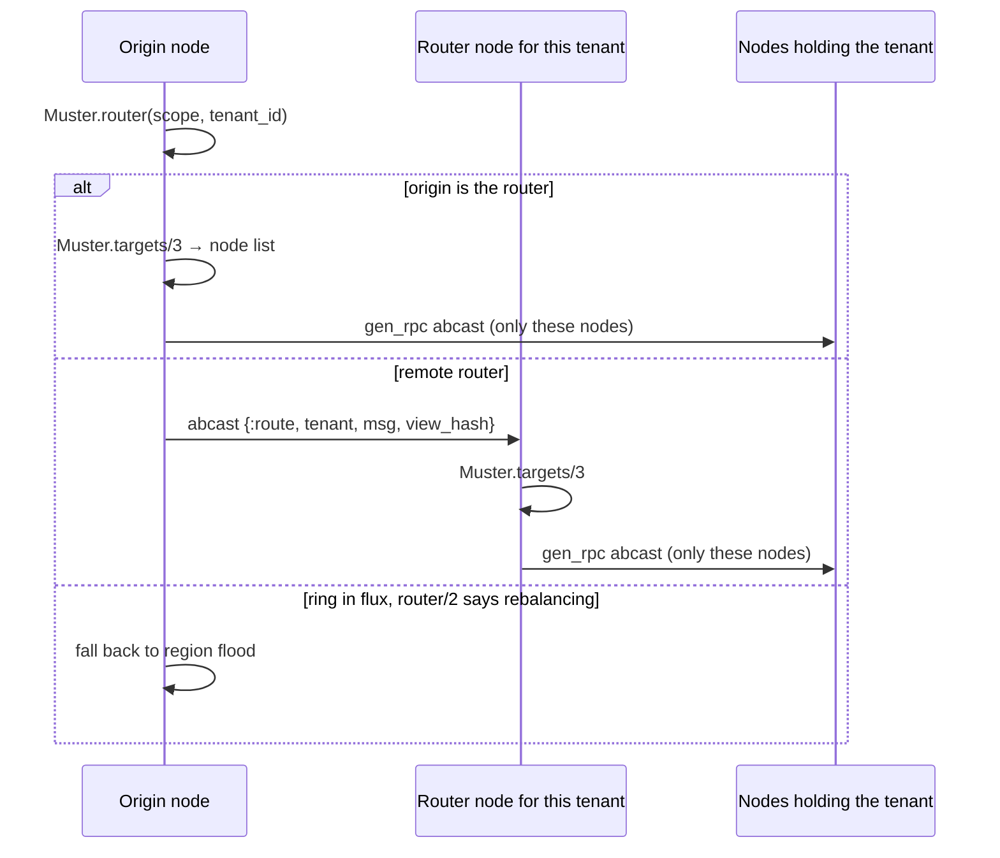
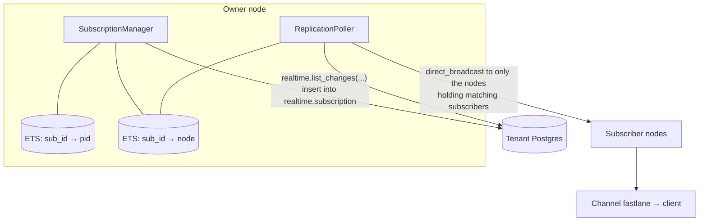

# Realtime Architecture

A high-level tour of how Realtime is put together, plus a few highlights of the less obvious parts.

## The Big Picture

Realtime is a multi-tenant Phoenix app where every node in the cluster runs the same code. A tenant is identified by its `external_id`.

Clients talk to Realtime over a single WebSocket that multiplexes many channels. Almost everything else in this document exists to serve one job: get a message published on a tenant's topic.

---

## Glossary

* [`Muster`](forum/README.md) - a library which helps answer "Which nodes hold clients of a tenant?"
* [OID](https://www.postgresql.org/docs/current/datatype-oid.html) - object identifiers, for instance for relations
* postgres_changes entry - a subscription on particular set of postgres changes (table, action, filters etc.)
* [replication slot](https://www.postgresql.org/docs/current/warm-standby.html#STREAMING-REPLICATION-SLOTS) - ensures retention of relevant WAL entries
* [`:syn`](https://github.com/ostinelli/syn) - process registry and process group manager for clusters
* tenant - a separate, isolated user of the infrastructure
* [WAL](https://www.postgresql.org/docs/current/wal-intro.html) - Write-Ahead Log, a log of all changes to a database

## The Main Flow

### 1. Websocket & Channels

`RealtimeWeb.UserSocket.connect/3`, mounted at `/socket` in `RealtimeWeb.Endpoint`:

- The **tenant** comes from the request host: `Database.get_external_id/1` turns `<external_id>.realtime.example.com` into an `external_id`.
- The **token** is the `x-api-key` header, falling back to the `apikey` param. It's a JWT verified against the tenant's `jwt_secret` / `jwt_jwks`.

The process owning the WebSocket is the transport pid. It shows up everywhere below: it's the unit counted for `max_concurrent_users`, the member registered into [Muster](forum/README.md), and the pid that ultimately receives the encoded WebSocket frame.
Channel topics look like `realtime:<sub_topic>` and are all handled by `RealtimeWeb.RealtimeChannel`. One socket can hold many of them (`max_channels_per_client`, default 100).

### 2. What a channel carries

| Feature | WebSocket Client sends | Produced by |
| --- | --- | --- |
| **Broadcast** | event of type `"broadcast"` | another client, the HTTP API, or an insert into `realtime.messages` |
| **Presence** | event of type `"presence"` | other clients' track/untrack, diffed and synced per topic |
| **Postgres Changes** | configured at join | the tenant's WAL, via `PostgresCdcRls` |

### 3. Fan-out and receive

`Realtime.PubSub` reaches other nodes through `Realtime.GenRpcPubSub`, an adapter built on [`gen_rpc`](https://github.com/emqx/gen_rpc) (wrapped locally by `Realtime.GenRpc`) instead of Erlang distribution, so nodes can have more than one TCP connection between them for more bandwidth. How it picks which nodes to send to is the subject of [Broadcast fan-out](#broadcast-fan-out). Erlang distribution is still used for other types of communications including being Muster & [`:syn`](https://github.com/ostinelli/syn) transport layer.

On each receiving node the local PubSub registry calls `MessageDispatcher.dispatch/3` with the topic's subscribers.

### The two per-tenant singletons

Two things are started once per tenant for the whole cluster on a node chosen by the placement rules in the next section.

`Realtime.Tenants.Connect` owns everything that needs the *tenant's own Postgres*. It provides:

- a **DBConnection pool** to the tenant database, published in `:syn` metadata as `conn:`, so any node can call `Connect.lookup_or_start_connection/1` and use that pool over RPC;
- **broadcast from the database**: the `ReplicationConnection` streams inserts into `realtime.messages` off a logical replication slot and republishes each row as a broadcast on the tenant topic;
- **lifecycle**: it stops itself when the tenant has had no connected users for a while or when it notices it's running in the wrong region.

`Extensions.PostgresCdcRls` is the Postgres Changes driver. Per tenant, if Postgres changes is used, it runs a `WorkerSupervisor` with a `SubscriptionManager` and a `ReplicationPoller`. What it provides:

- turning a channel's `postgres_changes` config (schema / table / filter) into rows in the tenant's `realtime.subscription` table;
- polling the tenant's WAL and delivering each change, already filtered per subscriber by `realtime.list_changes/4`, to only the nodes holding matching subscribers.

This means that if there are Postgres Changes subscriptions Realtime will be streaming two replication slots.

See [Postgres Changes](#postgres-changes) for the details.

---

## Tenant placement

The two singletons above (`Tenants.Connect` and the `PostgresCdcRls` `WorkerSupervisor`) have to exist exactly once per tenant across the whole cluster. Two things make that work: a deterministic node picker, and `:syn` as the registry that enforces uniqueness.

`Realtime.SynHandler` is our `:syn_event_handler` callback module: when the owner updates its
registry metadata (e.g. `conn:` goes from `nil` to a pid), it local-broadcasts a `"ready"` message
on `connect:<tenant_id>`, which is how callers waiting on a still-initializing `Connect` wake up.

### Highlight: picking a node by CPU load

`Realtime.Nodes.launch_node/3` decides which node should own a tenant. The tricky part is that many nodes may ask this question at the same time for the same tenant. If they disagree, two supervisors start and `:syn` has to kill one. So the choice must be deterministic across the cluster, while still spreading the load across the cluster.

- Region membership comes from `:syn.members(RegionNodes, region)`, sorted for stability. Tenant regions are mapped to the nearest Realtime region by `platform_region_translator/1` (overridable via `REGION_MAPPING`).
- The time bucket (default 60s, `:node_selection_time_bucket_seconds`) is the trick: every node computing in the same window picks the same two candidates, so concurrent requests agree. The next window picks a different pair, so placement spreads out over time. Agreement is best-effort not a guarantee. Requests landing on either side of a bucket edge (or on nodes with clock skew) get different candidate pairs. Then two singletons start and `:syn` resolves the conflict via `SynHandler.resolve_registry_conflict/4` (oldest registration wins, node name as tiebreak), stopping the loser with `{:shutdown, :syn_conflict_resolution}`.
- Load is `:cpu_sup.avg5/0`, fetched over `GenRpc` for remote nodes and cached in `Realtime.Nodes.Cache` for the bucket duration. A node that hasn't been up long enough (`:node_balance_uptime_threshold_in_ms`) reports `{:error, :not_enough_data}` and the picker falls back to consistent hashing — this keeps freshly booted nodes from looking artificially idle and absorbing every tenant.

The same picker is used for Postgres Changes (`PostgresCdcRls.start_distributed/1`).

### Highlight: syn as the cluster-wide registry

[`:syn`](https://github.com/ostinelli/syn) gives us a distributed process registry with metadata and conflict resolution. Realtime uses three kinds of scopes, set up in `Realtime.Application`:

| Scope | What's registered | Used for |
| --- | --- | --- |
| `RegionNodes` | one process per node, joined to a group named after its region | region membership → node selection, region flood |
| `Realtime.Tenants.Connect` | the `Connect` GenServer, keyed by `tenant_id` | find the tenant's DB pool from any node |
| `realtime_postgres_cdc_<shard>` | the CDC `WorkerSupervisor`, keyed by `tenant_id` | find the tenant's poller; sharded (`:postgres_cdc_scope_shards`) so one scope's table isn't a hot spot |

---

## Broadcast fan-out

Once a message is on the tenant topic, `Realtime.GenRpcPubSub` has to decide which nodes to send it to. Its default strategy is a **two-level flood**:

That's cheap on the wire per hop, but every node in every region receives every tenant's broadcast, even nodes with zero connections for that tenant.

### Highlight: Muster, so a broadcast only reaches nodes that care

[`Forum.Muster`](forum/README.md) (vendored in `forum/`) answers one question: *which nodes hold at least one member of a certain group?* Realtime uses `tenant_id` as the group and the client's `transport_pid` as the member.

- **On join** (`RealtimeChannel.join/3`, flag `use_muster_channel_join`): the channel registers its transport pid (with `tenant_id` as the group) into the region's Muster scope.
- **On broadcast** (`GenRpcPubSub.broadcast/4`, flag `use_muster_broadcast`): instead of flooding, ask Muster for the tenant's **router** node.

---

## Postgres Changes

`Extensions.PostgresCdcRls` in detail. Per tenant, one node runs a `WorkerSupervisor` with two children (both `significant`, so if either gives up the whole tree shuts down):

- `SubscriptionManager` — owns the tenant's rows in `realtime.subscription` and two ETS tables mapping subscription id → subscriber pid / subscriber node.
- `ReplicationPoller` — drains a temporary logical replication slot and fans changes out.

### The `realtime.subscription` table

This table is the interface between the channel layer and the WAL layer: a channel writes a row per `postgres_changes` entry and the poller reads those rows back to decide who gets what.

| Column | Type | What it holds |
| --- | --- | --- |
| `subscription_id` | `uuid` | generated per `postgres_changes` entry at join and the routing key back to the subscriber |
| `entity` | `regclass` | the watched table as an OID |
| `filters` | `realtime.user_defined_filter[]` | the client's `filter` string parsed into `(column_name, op, value, negate)` |
| `claims` | `jsonb` | the client's verified JWT claims |
| `claims_role` | `regrole` generated | `claims->>'role'` |
| `action_filter` | `text` | `*`, `INSERT`, `UPDATE` or `DELETE` |
| `selected_columns` | `text[]` | optional projection where `NULL` means every column the role may select |

A client joining with `{"event": "UPDATE", "schema": "public", "table": "todos", "filter": "user_id=eq.42"}` gets one row:

| `subscription_id` | `entity` | `filters` | `claims_role` | `action_filter` | `selected_columns` |
| --- | --- | --- | --- | --- | --- |
| `3f2b…-11ef-…` | `public.todos` | `{"(user_id,eq,42,f)"}` | `authenticated` | `UPDATE` | `NULL` |

`schema`/`table` may be `*`, in which case the insert expands to one row per published table sharing a single `subscription_id`.

 Every subscription is stored alongside the JWT the client presented when it joined. When a change comes off the WAL, Realtime doesn't hand it to the subscriber directly. It first asks the tenant's own database whether that specific client would have been allowed to read that specific row, using the client's identity and role. Only rows that come back visible are delivered, and columns the client's role can't select are stripped out of the payload before it leaves the database. So Postgres Changes never grants a client more access than a plain select would: the table's own row-level security policies are the thing being evaluated, not a copy of them maintained by Realtime. The one gap is deletes, where the row no longer exists to be checked, so subscribers get only its primary key.

---

## Presence

Presence is per tenant-topic state synced between nodes over the same PubSub. Each channel tracks the client's transport pid; joins/leaves and periodic syncs are diffed and broadcast to the topic. For private channels, presence writes are authorized via `Tenants.Authorization` policies evaluated against the tenant DB.

