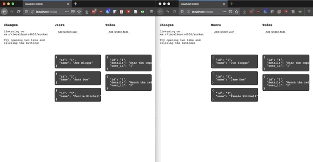

<br />
<p align="center">
  <a href="https://supabase.io">
    
  </a>

  <h1 align="center">Supabase Realtime</h1>

  <p align="center">
    Listens to changes in a PostgreSQL Database and broadcasts them over WebSockets.
    <br />
    <a href="https://github.com/supabase/realtime/issues/new?assignees=&labels=bug&template=1.Bug_report.md">Report Bug</a>
    ·
    <a href="https://github.com/supabase/realtime/issues/new?assignees=&labels=enhancement&template=2.Feature_request.md">Request Feature</a>
    <br />
    <br />
    <kbd></kbd>
  </p>
</p>


## Hiring

Supabase is hiring Elixir experts to work full-time on this repo. If you have the experience, [apply online](https://supabase.io/docs/careers).


## Project Status

- [x] Alpha: Under heavy development
- [x] Public Alpha: Ready for use. But go easy on us, there may be a few kinks.
- [x] Public Beta: Stable enough for most non-enterprise use-cases
- [x] Public Gamma: Realtime RLS broadcasts changes to authorized subscribers based on Row Level Security (RLS) policies.
- [ ] Public: Production-ready

This repo is still under heavy development and the documentation is constantly evolving. You're welcome to try it, but expect some breaking changes. Watch "releases" of this repo to get notified of major updates. And give us a star if you like it!

[Watch this repo][watch-repo-url]


## Introduction

### What is this?

This is a server built with Elixir using the [Phoenix Framework](https://www.phoenixframework.org) that allows you to listen to changes in your PostgreSQL database via logical replication and then broadcast those changes via WebSockets.

There are two versions of this server: `Realtime` and `Realtime RLS`.

`Realtime` server works by:

1. listening to PostgreSQL's replication functionality (using PostgreSQL's logical decoding)
2. converting the byte stream into JSON
3. broadcasting to all connected clients over WebSockets

`Realtime RLS` server works by:

1. polling PostgreSQL's replication functionality (using PostgreSQL's logical decoding and [wal2json](https://github.com/eulerto/wal2json) output plugin)
2. passing database changes to a [Write Ahead Log Realtime Unified Security (WALRUS)](https://github.com/supabase/walrus) PostgresSQL function and receiving a list of authorized subscribers depending on Row Level Security (RLS) policies
3. converting the changes into JSON
3. broadcasting to authorized subscribers over WebSockets

### Why not just use PostgreSQL's `NOTIFY`?

A few reasons:

1. You don't have to set up triggers on every table.
2. `NOTIFY` has a payload limit of 8000 bytes and will fail for anything larger. The usual solution is to send an ID and then fetch the record, but that's heavy on the database.
3. `Realtime` server consumes two connections to the database, then you can connect many clients to this server. Easier on your database, and to scale up you just add additional `Realtime` servers.

### What are the benefits?

1. The beauty of listening to the replication functionality is that you can make changes to your database from anywhere - your API, directly in the DB, via a console, etc. - and you will still receive the changes via WebSockets.
2. Decoupling. For example, if you want to send a new slack message every time someone makes a new purchase you might build that functionality directly into your API. This allows you to decouple your async functionality from your API.
3. This is built with Phoenix, an [extremely scalable Elixir framework](https://www.phoenixframework.org/blog/the-road-to-2-million-websocket-connections).

### Does this server guarantee delivery of every data change?

Not yet! Due to the following limitations:

1. Postgres database runs out of disk space due to Write-Ahead Logging (WAL) buildup, which can crash the database and prevent Realtime server from receiving and broadcasting changes. This can be mitigated in the Realtime RLS version of this server by setting the Postgres config `max_slot_wal_keep_size` to a reasonable size.
2. Realtime server can crash due to a larger replication lag than available memory, forcing the creation of a new replication slot and resetting replication to read from the latest WAL data.
3. When Realtime server falls too far behind for any reason, for example disconnecting from database as WAL continues to build up, then database can delete WAL segments the server still needs to read from, for example after reconnecting.

## Quick start

We have set up some simple examples that show how to use this server:

- [Next.js example](https://github.com/supabase/realtime/tree/master/examples/next-js)
- [NodeJS example](https://github.com/supabase/realtime/tree/master/examples/node-js)


## Client libraries

- JavaScript: [@supabase/realtime-js](https://github.com/supabase/realtime-js)
- Python: [@supabase/realtime-py](https://github.com/supabase/realtime-py)
- Dart: [@supabase/realtime-dart](https://github.com/supabase/realtime-dart)
- C#: [@supabase/realtime-csharp](https://github.com/supabase/realtime-csharp)

### Realtime RLS

The JavaScript and C# client libraries are now compatible with Realtime RLS. To get started, create a database table inside the `public` schema, enable row level security, and set at least one row security policy. Then, pass a JWT with your claims, `role` (a database role like `postgres`) is required, when creating a channel.

You will have to manually update the Realtime Client with a valid JWT because Realtime RLS will continuously verify the JWT on every heartbeat. If the JWT is invalid (e.g. expired), then Realtime RLS will terminate the channel.

JavaScript Client example:

```js
import { RealtimeClient } = '@supabase/realtime-js'

var socket = new RealtimeClient(
  process.env.REALTIME_URL || 'ws://localhost:4000/socket',
  {
    params: {
      apikey: JWT
    }
  }
)
socket.connect()

var channel = socket.channel('realtime:public:rls_table', { user_token: JWT })
channel.on('INSERT', msg => {
  console.log(msg)
})
channel
  .subscribe()
  .receive('ok', () => console.log('Connected!'))

// Set the JWT so Realtime can verify and keep the channel alive
socket.setAuth(JWT)

// Call setAuth again when there's a new valid JWT (e.g. refreshed JWT)
socket.setAuth(REFRESHED_JWT)
```

## Event Filters with Examples

### Prerequisites for running event filter examples

- `Realtime` server running locally (See [Server set up](#server-set-up) for instructions)
- [@supabase/realtime-js](https://github.com/supabase/realtime-js) installed locally

```js
import { RealtimeClient } = '@supabase/realtime-js'

var socket = new RealtimeClient(process.env.REALTIME_URL || 'ws://localhost:4000/socket')
socket.connect()
```

### Supported event types
  - `*`
  - `INSERT`
  - `UPDATE`
  - `DELETE`

### Supported event filters

- Listen to all database changes
  - Channel format: `realtime:*`

```js
// Listen to all deletes in database
var allChanges = socket
  .channel('realtime:*')
  .join()
  .on('DELETE', payload => { console.log('Delete received!', payload) })
```

- Listen to a specific schema's changes
  - Channel format: `realtime:schema`

```js
// Listen to all inserts from the 'public' schema
var allPublicInsertChanges = socket
  .channel('realtime:public')
  .join()
  .on('INSERT', payload => { console.log('Insert received!', payload) })
```

- Listen to a specific table's changes
  - Channel format: `realtime:schema:table`

```js
// Listen to all updates on the 'users' table in the 'public' schema
var allUsersUpdateChanges = socket
  .channel('realtime:public:users')
  .join()
  .on('UPDATE', payload => { console.log('Update received!', payload) })
```

- Listen to a specific column's value changes
  - Channel format: `realtime:schema:table:column=eq.value`

```js
// Listen to all changes to user ID 99
var allUserId99Changes = socket
  .channel('realtime:public:users:id=eq.99')
  .join()
  .on('*', payload => { console.log('Change received!', payload) })
```


## Server

### Database Setup

Both versions of Realtime server, Realtime and Realtime RLS, have the following database requirements:

1. Set up your DB for replication
   1. It must have the `wal_level` set to logical. You can check this by running `SHOW wal_level;`. To set the `wal_level`, you can call `ALTER SYSTEM SET wal_level = logical;`
   2. You must set `max_replication_slots` to at least 1: `ALTER SYSTEM SET max_replication_slots = 5;`
2. Create a `PUBLICATION` for this server to listen to: `CREATE PUBLICATION supabase_realtime FOR ALL TABLES;`
3. [OPTIONAL] If you want to receive the old record (previous values) on UPDATE and DELETE, you can set the `REPLICA IDENTITY` to `FULL` like this: `ALTER TABLE your_table REPLICA IDENTITY FULL;`. This has to be set for each table unfortunately.

### Realtime RLS Database Setup

- It must be Postgres 9.4+ as it uses `wal2json` output plugin. We recommend Postgres 12+.
- Set `max_slot_wal_keep_size` to a reasonable size to prevent WAL buildup from crashing your database. You can set it with `ALTER SYSTEM SET max_slot_wal_keep_size = '1024MB';`

### Realtime RLS Server Setup

To get started, run `docker-compose -f docker-compose.rls.dev.yml up`

**ALL RELEVANT OPTIONS**

```sh
DB_HOST                    # {string}      Database host URL
DB_NAME                    # {string}      Postgres database name
DB_USER                    # {string}      Database user
DB_PASSWORD                # {string}      Database password
DB_PORT                    # {number}      Database port
DB_SSL                     # {string}      (options: 'true'/'false') Database SSL connection
DB_IP_VERSION              # {string}      (options: 'IPv4'/'IPv6') Connect to database via either IPv4 or IPv6. Disregarded if database host is an IP address (e.g. '127.0.0.1') and recommended if database host is a name (e.g. 'db.abcd.supabase.co') to prevent potential non-existent domain (NXDOMAIN) errors.
REPLICATION_MODE           # {string}      (options: 'STREAM'/'RLS') Spin up server as Realtime or Realtime RLS. Defaults to 'STREAM'. Set to 'RLS' to enable Realtime RLS.
SLOT_NAME                  # {string}      A unique name for Postgres to track where this server has "listened until". If the server dies, it can pick up from the last position. This should be lowercase.
TEMPORARY_SLOT             # {string}      (options: 'true'/'false') Start logical replication slot as either temporary or permanent.
PORT                       # {number}      Port which you can connect your client/listeners
PUBLICATIONS               # {string} JSON encoded array of publication names. Realtime RLS currently accepts one publication.
SECURE_CHANNELS            # {string}      (options: 'true'/'false') Enable/Disable channels authorization via JWT verification.
JWT_SECRET                 # {string}      HS algorithm octet key (e.g. "95x0oR8jq9unl9pOIx"). Only required if SECURE_CHANNELS is set to true.
JWT_CLAIM_VALIDATORS       # {string}      Expected claim key/value pairs compared to JWT claims via equality checks in order to validate JWT. e.g. '{"iss": "Issuer", "nbf": 1610078130}'. This is optional but encouraged.
EXPOSE_METRICS             # {string}      (options: 'true'/'false') Expose Prometheus metrics at '/metrics' endpoint. Currently supports active websocket connection and active topic subscription totals. Defaults to 'true' in development and 'false' in production.
DB_RECONNECT_BACKOFF_MIN   # {number} Specify the minimum amount of time to wait before reconnecting to database. Defaults to 100 (milliseconds).
DB_RECONNECT_BACKOFF_MAX   # {number} Specify the maximum amount of time to wait before reconnecting to database. Defaults to 120000 (milliseconds).
REPLICATION_POLL_INTERVAL  # {number} Specify how often Realtime RLS should poll the replication slot for changes. Defaults to 300 (milliseconds).
SUBSCRIPTION_SYNC_INTERVAL # {number} Specify how often Realtime RLS should confirm connected subscribers and the tables they're listening to. Defaults to 60000 (milliseconds).
MAX_RECORD_BYTES           # {number} Controls the maximum size of a WAL record. When the size of the record exceeds max_record_bytes the record and old_record, if applicable, keys are set as empty objects and the errors output array will contain the string "Error 413: Payload Too Large". Defaults to 1048576 (bytes), which is 1MB.
```

### Realtime Database Setup

- It must be Postgres 10+ as it uses logical replication.

### Realtime Server Setup

The easiest way to get started is just to use our docker image. We will add more deployment methods soon.

```sh
# Update the environment variables to point to your own database
docker run                                  \
  -e DB_HOST='docker.for.mac.host.internal' \
  -e DB_NAME='postgres'                     \
  -e DB_USER='postgres'                     \
  -e DB_PASSWORD='postgres'                 \
  -e DB_PORT=5432                           \
  -e PORT=4000                              \
  -e JWT_SECRET='SOMETHING_SUPER_SECRET'    \
  -p 4000:4000                              \
  supabase/realtime
```

**ALL RELEVANT OPTIONS**

```sh
DB_HOST                 # {string}      Database host URL
DB_NAME                 # {string}      Postgres database name
DB_USER                 # {string}      Database user
DB_PASSWORD             # {string}      Database password
DB_PORT                 # {number}      Database port
DB_SSL                  # {string}      (options: 'true'/'false') Database SSL connection
DB_IP_VERSION           # {string}      (options: 'IPv4'/'IPv6') Connect to database via either IPv4 or IPv6. Disregarded if database host is an IP address (e.g. '127.0.0.1') and recommended if database host is a name (e.g. 'db.abcd.supabase.co') to prevent potential non-existent domain (NXDOMAIN) errors.
REPLICATION_MODE        # {string}      (options: 'STREAM'/'RLS') Spin up server as Realtime or Realtime RLS. Defaults to 'STREAM'.
SLOT_NAME               # {string}      A unique name for Postgres to track where this server has "listened until". If the server dies, it can pick up from the last position. This should be lowercase. If not provided then Realtime is started with a temporary slot.
PORT                    # {number}      Port which you can connect your client/listeners
PUBLICATIONS            # {string} JSON encoded array of publication names
SECURE_CHANNELS         # {string}      (options: 'true'/'false') Enable/Disable channels authorization via JWT verification.
JWT_SECRET              # {string}      HS algorithm octet key (e.g. "95x0oR8jq9unl9pOIx"). Only required if SECURE_CHANNELS is set to true.
JWT_CLAIM_VALIDATORS    # {string}      Expected claim key/value pairs compared to JWT claims via equality checks in order to validate JWT. e.g. '{"iss": "Issuer", "nbf": 1610078130}'. This is optional but encouraged.
MAX_REPLICATION_LAG_MB  # {number}      If set, when the replication lag exceeds MAX_REPLICATION_LAG_MB (value must be a positive integer in megabytes), then replication slot is dropped, Realtime is restarted, and a new slot is created. Warning: setting MAX_REPLICATION_SLOT_MB could cause database changes to be lost when the replication slot is dropped.
EXPOSE_METRICS          # {string}      (options: 'true'/'false') Expose Prometheus metrics at '/metrics' endpoint. Currently supports active websocket connection and active topic subscription totals. Defaults to 'true' in development and 'false' in production.
```

**EXAMPLE: RUNNING SERVER WITH ALL RELEVANT OPTIONS**

```sh
# Update the environment variables to point to your own database
docker run                                                       \
  -e DB_HOST='docker.for.mac.host.internal'                      \
  -e DB_NAME='postgres'                                          \
  -e DB_USER='postgres'                                          \
  -e DB_PASSWORD='postgres'                                      \
  -e DB_PORT=5432                                                \
  -e DB_SSL='false'                                              \
  -e DB_IP_VERSION='IPv4'                                        \
  -e REPLICATION_MODE='STREAM'                                   \
  -e SLOT_NAME='supabase_realtime'                               \
  -e PORT=4000                                                   \
  -e PUBLICATIONS="[\"supabase_realtime\"]"                      \
  -e SECURE_CHANNELS='true'                                      \
  -e JWT_SECRET='SOMETHING_SUPER_SECRET'                         \
  -e JWT_CLAIM_VALIDATORS='{"iss": "Issuer", "nbf": 1610078130}' \
  -e MAX_REPLICATION_LAG_MB=1000                                 \
  -e EXPOSE_METRICS='true'                                       \
  -p 4000:4000                                                   \
  supabase/realtime
```


## Websocket Connection Authorization

Websocket connections are authorized via symmetric JWT verification. Only supports JWTs signed with the following algorithms:
  - HS256
  - HS384
  - HS512

Verify JWT claims by setting JWT_CLAIM_VALIDATORS:

  > e.g. {'iss': 'Issuer', 'nbf': 1610078130}
  >
  > Then JWT's "iss" value must equal "Issuer" and "nbf" value must equal 1610078130.

**NOTE:** JWT expiration is checked automatically. 

**Development**: Channels are not secure by default. Set SECURE_CHANNELS to `true` to test JWT verification locally.

**Production**: Channels are secure by default and you must set JWT_SECRET. Set SECURE_CHANNELS to `false` to proceed without checking authorization.

**Authorizing Client Connection**: You can pass in the JWT by following the instructions under **Usage** in the [@supabase/realtime-js](https://github.com/supabase/realtime-js) client library or as query param in the WebSocket URL (e.g. `wss://abc.supabase.co/realtime/v1/websocket?vsn=1.0.0&apikey=jwt`).

## License

This repo is licensed under Apache 2.0.


## Credits

- [Phoenix](https://github.com/phoenixframework/phoenix) - `Realtime` server is built with the amazing Elixir framework.
- [Cainophile](https://github.com/cainophile/cainophile) & [PgoutputDecoder](https://github.com/cainophile/pgoutput_decoder) - A lot of this implementation leveraged the work already done in the Cainophile and PgoutputDecoder libraries.
- [Phoenix Channels Client](https://github.com/mcampa/phoenix-channels) - [@supabase/realtime-js](https://github.com/supabase/realtime-js) client library is ported from the Phoenix Channels Client library.


## Sponsors

We are building the features of Firebase using enterprise-grade, open source products. We support existing communities wherever possible, and if the products don’t exist we build them and open source them ourselves.

[![New Sponsor][new-sponsor-image]][new-sponsor-url]


[new-sponsor-image]: https://user-images.githubusercontent.com/10214025/90518111-e74bbb00-e198-11ea-8f88-c9e3c1aa4b5b.png
[new-sponsor-url]: https://github.com/sponsors/supabase
[watch-repo-url]: https://github.com/supabase/realtime/watchers
