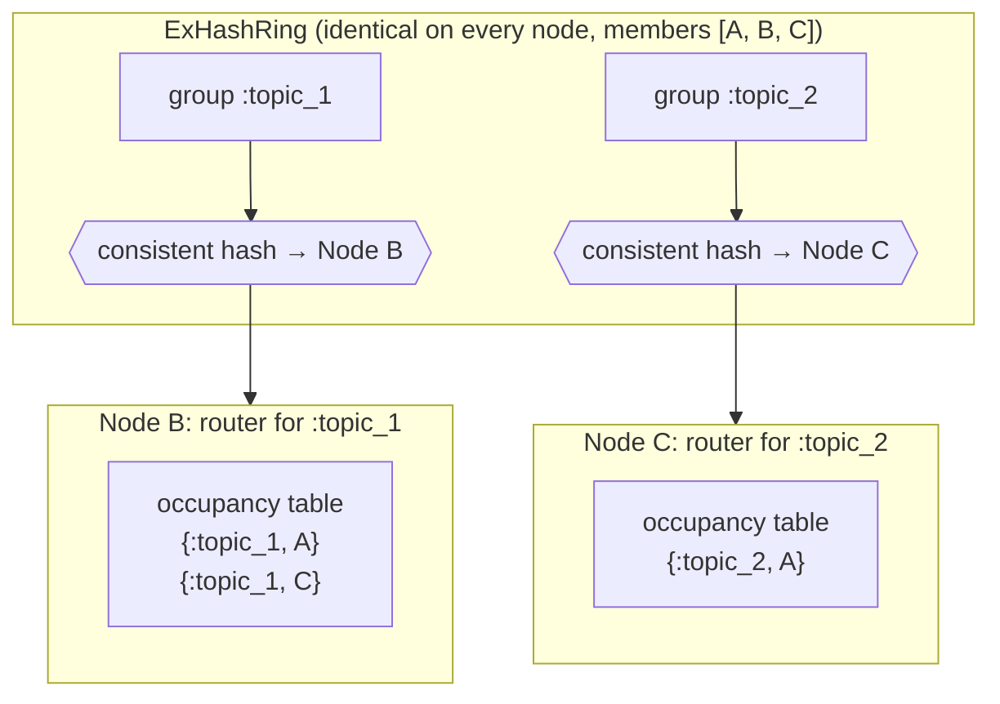
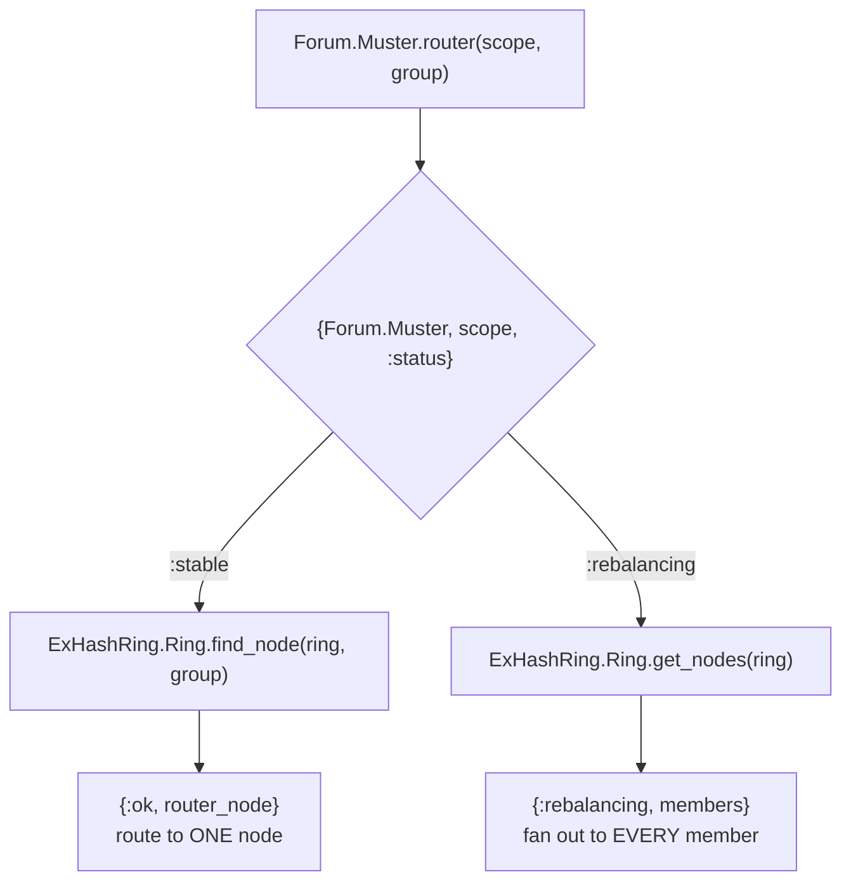
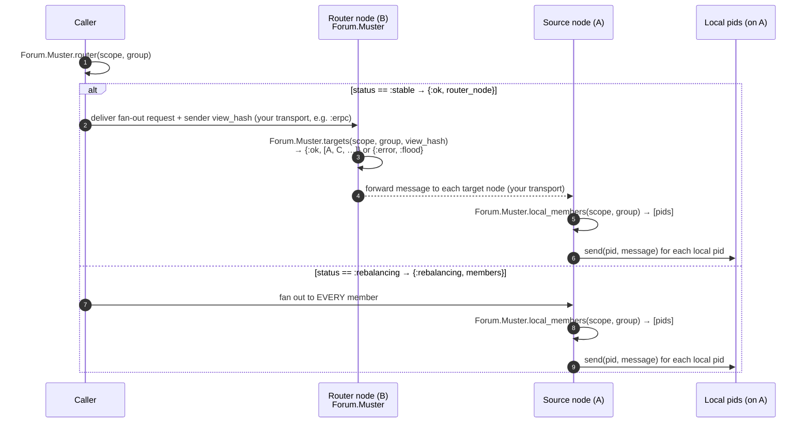

# Broadcasting through Muster's router node

`Forum.Muster` answers one question: *given a group, which nodes hold local
members of it?*, and lets you route a fan-out broadcast precisely instead of
blasting every node in the cluster.

The key thing to internalize: **Muster owns the routing decision, you supply the
transport.** Muster never sends your message for you. It gives you three
primitives, and you wire them together with whatever transport you like
(`:erpc`, the built-in `Forum.Adapter.ErlDist`, Phoenix.PubSub, HTTP, …):

| Primitive | Where you run it | What it gives you |
| --- | --- | --- |
| `Forum.Muster.router(scope, group)` | anywhere | the single **router node** for the group (or, mid-rebalance, every member) |
| `Forum.Muster.targets(scope, group, sender_view_hash)` | on the **router node** | `{:ok, source_nodes}` from the occupancy table, or `{:error, :flood}` when the table can't be trusted |
| `Forum.Muster.local_members(scope, group)` | on a **source node** | the local **pids** to deliver to |

A broadcast is therefore a caller-wired, 3-hop flow: *caller → router → source
nodes → local pids.*

---

## 1. The router node and its occupancy table

For each group, exactly one node is the **router**, chosen by consistent hashing
([`ex_hash_ring`](https://hexdocs.pm/ex_hash_ring)) over the sorted member list.
Every node computes the same router independently from the same ring: no
consensus, the member list is the only input. The router owns an occupancy table
keyed by `{group, source_node}`: the authoritative set of nodes a broadcast for
that group must reach.

The table is maintained for you: when the first local member of a group joins on
node A, A sends a synchronous `:occupied` notification to the router; when the
last leaves (after a cooldown), a periodic flush sends a batched `:vacant_batch`.
See the README for the join/leave and rebalance details.

You don't read the table directly — `targets/3` does it for you, and only after
checking a **readiness barrier**: a broadcast carries the sender's cluster-view
hash, and the router returns `{:ok, source_nodes}` only when it is `:ready` and
agrees with the sender about membership (so its table is provably complete).
Otherwise it returns `{:error, :flood}`, and you fan out to everyone your
transport knows (e.g. every node in the region), trading a brief burst of extra
traffic for never missing a holder while the cluster view settles. See the
README's *Router-readiness barrier* for why this is needed even when `router/2`
says the cluster is stable.

---

## 2. Picking the target: `router/2`

Before broadcasting, ask `router/2` for the group's router. It reads a small
`persistent_term` status flag and either returns a single node (stable cluster)
or signals that the cluster view is in flux and you should fan out to everyone.

The `:rebalancing` branch is what keeps broadcasts correct while membership
changes: rather than risk routing to a node that just stopped being the router,
the caller temporarily broadcasts to all members. The window is short because
consistent hashing only remaps ~1/N of groups per node change.

---

## 3. The end-to-end broadcast

Putting it together. On a stable cluster you take the cheap single-router path;
during a rebalance you fan out to all members. In both cases delivery to actual
pids happens *on the node that owns them*: pids never leave their node.

### Why this shape

- **Precision.** On the stable path the caller contacts exactly one router, and
  the router contacts exactly the source nodes that have members, not the whole
  cluster.
- **Locality.** Only the node that owns a pid ever sends to it, so delivery
  scales with where members actually live.
- **Safety during change.** The `:rebalancing` fan-out trades a brief burst of
  extra traffic for never missing a node whose router assignment is mid-flight.

See the top-level [`README.md`](../README.md) for the join, leave/cooldown,
rebalance, and failure-handling details that keep the occupancy table accurate.
